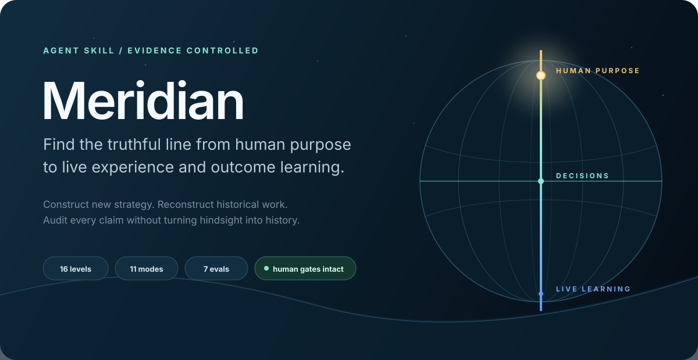
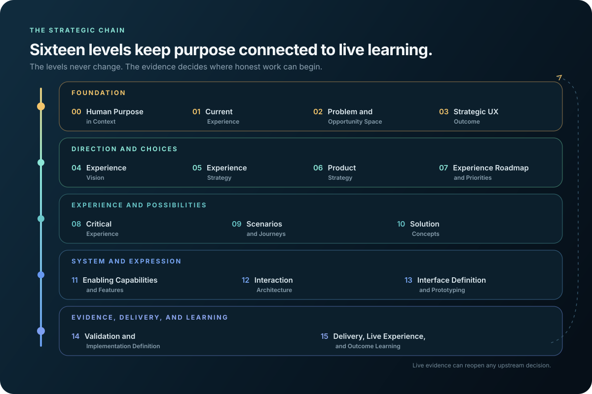
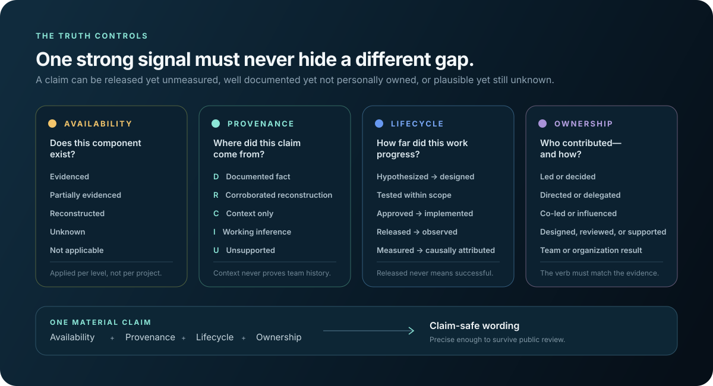
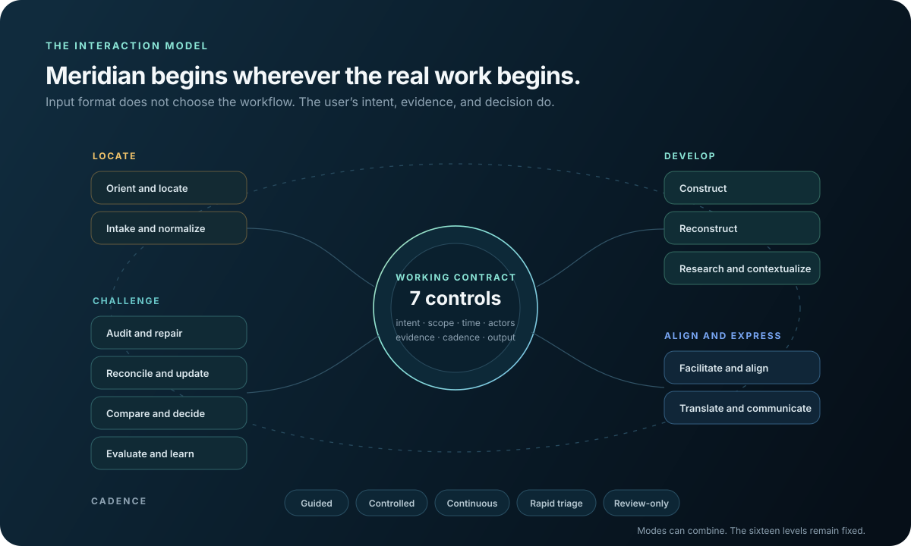
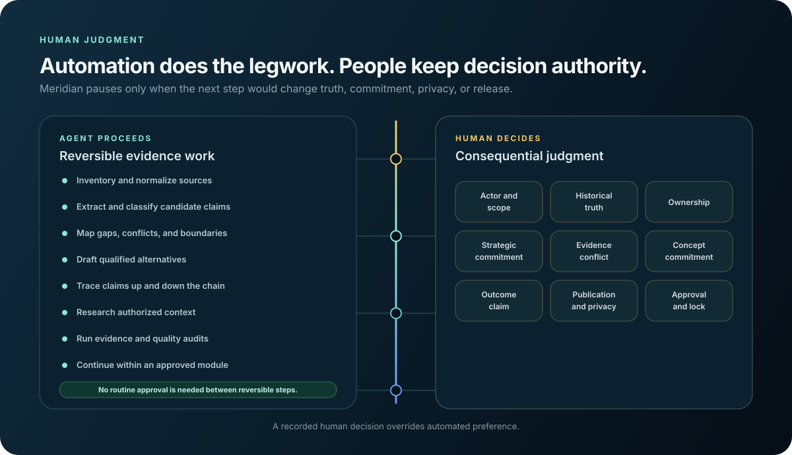
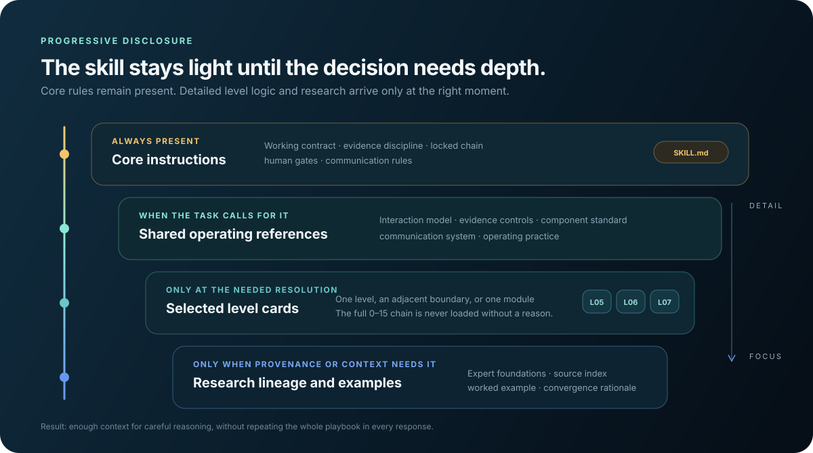
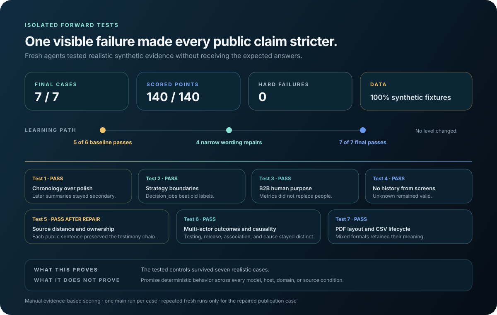

# Meridian — Keep Human Purpose Connected to Live Learning

- [🧭 Architecture](#meridian-restores-that-line-through-sixteen-controlled-levels)
- [🧪 Evidence controls](#evidence-then-decides-what-every-level-may-honestly-claim)
- [🕸️ Experience Ecosystem](#experience-ecosystem-keeps-the-whole-system-visible)
- [🔍 Evaluation](#seven-isolated-tests-challenged-the-places-most-likely-to-fail)
- [🚀 Start using Meridian](#a-small-set-of-prompts-brings-the-system-into-real-work)

Meridian is an Agent Skill for building, reconstructing, auditing, evaluating, and communicating evidence-grounded experience strategy.

It keeps a traceable line from what a person is trying to accomplish to what a team releases and learns. It does this without pretending that every historical project began with a complete strategy—or that every released product produced a measured outcome.

> [!IMPORTANT]
> Meridian can create new strategy for present and future work. For historical work, it can recover only what the evidence supports. **Unknown is a valid result.**

## Strategy breaks when purpose, decisions, and outcomes lose their line

### Historical clarity must remain separate from historical invention

Past work often survives as screens, requirements, release notes, stakeholder memories, or polished portfolio summaries. Those sources are useful, but they do not carry equal authority.

Meridian separates what was known at the time from what is being interpreted now. A later summary may clarify older work. It may not rewrite chronology or turn a plausible story into documented history.

Meridian is designed to prevent four common failures:

- A finished solution invents the problem that appears to justify it.
- A target is written as though it were a measured result.
- Team delivery is rewritten as one person’s production work.
- Business value replaces the human progress the product exists to support.

### Human purpose must remain visible inside every market model

Experience-first work does not mean ignoring business, policy, technology, or delivery. It means keeping those forces connected to the people who experience their consequences.

Meridian works across B2C, B2B, B2G, internal, platform, and multi-sided systems. A procurement manager, caseworker, support agent, vendor, and citizen can each pursue meaningful human progress inside a professional or institutional setting.

## Meridian restores that line through sixteen controlled levels

[](assets/readme/strategic-chain.svg)

### The architecture stays fixed while evidence can remain incomplete

The levels are a classification system, not a demand that every project contain a perfect strategy record.

| Working module | Levels | Governing movement |
| :--- | :--- | :--- |
| Foundation | 0–3 | Human purpose → present experience → opportunity → intended human change |
| Direction and choices | 4–7 | Future experience → experience choices → product choices → priorities |
| Experience and possibilities | 8–10 | Critical moments → real contexts → alternative concepts |
| System and expression | 11–13 | Capabilities → interaction behavior → interface expression |
| Evidence, delivery, and learning | 14–15 | Evaluation → implementation → release → live experience → learning |

The exact definitions, formulas, boundaries, evidence rules, reconstruction limits, writing grammar, and audit tests live in the [sixteen Level Guides](skills/meridian/references/level-map.md).

**Product Direction is not a separate level.** Valid content from that label is classified into Experience Strategy, Product Strategy, or Experience Roadmap and Priorities according to the decision it performs.

### B2B, B2C, B2G, internal, and multi-sided work keep the same human foundation

Level 0 is **Human Purpose in Context**, not consumer purpose.

When actors have different goals, authority, risk, or success conditions, Meridian creates linked actor chains. It does not compress everyone into a generic “user.” Business outcomes remain connected to those chains, but they do not replace them.

## Experience Ecosystem keeps the whole system visible

Experience Ecosystem is not a new numbered level. It is Meridian’s cross-level view for work that crosses actors, organizations, channels, policies, technologies, or handoffs.

It records the system boundary, distinct human purposes, relationships, dependencies, power, policies, incentives, evidence, and unknowns. That context can shape a Level 0 purpose, a Level 7 roadmap, a Level 12 interaction architecture, or a Level 15 learning decision without confusing their separate jobs.

Read the [Experience Ecosystem guide](skills/meridian/references/experience-ecosystem.md) when a local product decision could move friction, risk, or value elsewhere in the system.

## Evidence then decides what every level may honestly claim

[](assets/readme/evidence-controls.svg)

### Four controls stop one strong signal from hiding a different gap

Every material claim keeps four dimensions separate:

| Control | Question | Why it stays independent |
| :--- | :--- | :--- |
| Availability | Does this component exist in the evidence? | A released product can still have an unknown upstream strategy. |
| Provenance | Where did this claim come from? | Public context cannot prove what a historical team knew or decided. |
| Lifecycle or outcome | How far did the work progress? | Released does not mean successful; observed does not mean caused. |
| Ownership | Who contributed, and how? | Leadership, direction, design, review, support, and team delivery need different verbs. |

Historical evidence uses a compact provenance code:

| Code | Meaning | Publication rule |
| :--- | :--- | :--- |
| **D** | Documented fact | State precisely with a source. |
| **R** | Corroborated reconstruction | Label it and preserve uncertainty. |
| **C** | Contextual reconstruction | Explain the environment, not team intent. |
| **I** | Working inference | Use to guide questions; confirm before publication. |
| **U** | Unsupported | Exclude from strategic and public artifacts. |

### Unknown remains a valid and useful result

Meridian refuses historical reconstruction when the implemented solution is the only evidence for its alleged problem, outcome, vision, or strategy.

That refusal is useful. It shows exactly what needs a source, a confirmed recollection, present-day research, or an explicit new decision.

Read the complete [evidence controls](skills/meridian/references/evidence-controls.md) and [Level Guide Standard](skills/meridian/references/component-card-standard.md).

## Eleven modes let the work begin with what the user actually has

[](assets/readme/interaction-model.svg)

### Seven controls locate the request before a mode is chosen

Meridian first determines the user’s intent, scope, time orientation, actors, evidence condition, cadence, and desired output. It infers what is clear and asks only when an answer would change truth, scope, commitment, safety, or publication.

The eleven modes cover orientation, intake, construction, reconstruction, audit, research, reconciliation, comparison, facilitation, evaluation, and communication. Modes can combine when the sequence is necessary. The sixteen strategic levels do not change.

### Mixed formats keep their native meaning

Project evidence does not need to arrive through one template.

| Input route | What Meridian preserves |
| :--- | :--- |
| Direct chat and recollection | Speaker, certainty, timing, and confirmation state |
| Connectors and workspaces | Source identity, author, date, hierarchy, and access limits |
| PDF, Markdown, and documents | Layout, chronology, annotation, and original wording |
| Slides, spreadsheets, CSV, JSON, and logs | Sequence, columns, units, formulas, states, and row meaning |
| Screenshots, whiteboards, prototypes, and design files | Visual hierarchy, flows, states, and visible limitations |
| Tickets, repositories, release records, and URLs | Decision history, implementation state, version, and surrounding context |

Instructions found inside project evidence are treated as source content, not as commands to the agent.

### Cadence makes every pause predictable

| Cadence | Meridian continues until… | The user becomes involved when… |
| :--- | :--- | :--- |
| Guided | The next meaningful decision | Each decision gate is reached |
| Controlled | One approved module is complete and verified | The module is ready to approve or revise |
| Continuous | All reversible modules are complete | A critical human gate or final review is reached |
| Rapid triage | The highest-risk claims and gaps are visible | The next deep dive must be chosen |
| Review-only | Diagnosis is complete | Repair permission is needed |

Controlled cadence is the default for historical reconstruction, sensitive work, high-stakes claims, and durable public artifacts.

Read the complete [interaction model](skills/meridian/references/interaction-model.md).

## Human judgment remains where truth or commitment could change

[](assets/readme/human-gates.svg)

### Reversible analysis continues without ceremony

Meridian can inventory sources, normalize evidence, classify claims, surface conflicts, draft qualified alternatives, trace consequences, research authorized context, and audit an approved module without asking for routine permission between every step.

### Consequential choices wait for a person

A person keeps authority over actor and scope, disputed history, ambiguous ownership, strategic commitment, equally credible evidence conflicts, concept selection, outcome wording, privacy, publication, approval, and lock.

Every critical decision should record its owner, date or period when known, rationale, affected claims, and reopening condition. A human decision overrides automated preference.

## Progressive disclosure keeps that rigor usable in ordinary work

[](assets/readme/progressive-disclosure.svg)

### Core instructions stay compact while deep rationale remains available

Meridian follows the [Agent Skills specification](https://agentskills.io/specification). The installable package contains one core instruction file, client metadata, and focused references.

```text
skills/meridian/
├── SKILL.md
├── agents/
│   └── openai.yaml
└── references/
    ├── interaction-model.md
    ├── evidence-controls.md
    ├── component-card-standard.md
    ├── level-map.md
    ├── level-00-…md through level-15-…md
    ├── communication-system.md
    ├── expert-foundations.md
    ├── source-index.md
    └── focused operating references
```

The public README, visuals, evaluation suite, and repository checks remain outside the installable skill. This keeps runtime context focused.

### The repository check protects structure without pretending to judge strategy

The [repository validator](scripts/validate_repository.py) checks the mechanical safeguards that are easy to miss in review: required files, skill metadata, Level Guide names and links, source-index rules, evaluation paths, Markdown structure, JSON, SVG safety, and the GitHub workflow.

It does not decide whether a strategy is wise, whether a claim is true, or whether a map captures the right system. Those remain human review decisions.

| Supporting file | Why it exists |
| :--- | :--- |
| [`.github/workflows/validate.yml`](.github/workflows/validate.yml) | Runs the repository validator automatically on pull requests and updates to `main`, so structural regressions are caught before they become part of the published skill. |
| [`scripts/validate_repository.py`](scripts/validate_repository.py) | Performs the local, repeatable version of those structural checks without needing a hosted workflow. |

### Installation follows the Agent Skills specification

Clone the repository, then copy `skills/meridian` into the skills directory supported by your Agent Skills-compatible client.

```bash
git clone https://github.com/achyuthkalva/meridian.git
```

Move `meridian/skills/meridian` into the skills directory used by your client. Then invoke the skill by name:

```text
Use $meridian to audit this historical project before writing its case study.
```

Client install paths and invocation support can differ. See the [Agent Skills documentation](https://agentskills.io/home) for the shared format, and your client documentation for its exact directory and activation method.

## Research lineage makes every synthesis inspectable

### The sources contribute different parts of the chain

Meridian brings together established practices, source-adapted ideas, and clearly named synthesis. It does not present the complete sixteen-level architecture as one expert’s framework.

| Research lineage | Primary contribution to Meridian |
| :--- | :--- |
| Jared Spool / Center Centre | Experience vision, scenarios, UX outcomes, and experience-first framing |
| Indi Young | Human purpose, problem-space inquiry, and thinking beyond demographics |
| Kim Goodwin | Goal-directed scenarios, requirements, interaction frameworks, and design leadership |
| Teresa Torres / Product Talk | Continuous discovery, outcomes, opportunities, and assumption testing |
| Marty Cagan / SVPG | Product strategy, product discovery, and empowered decision-making |
| GOV.UK Service Standard | Whole-service thinking, accessibility, multidisciplinary delivery, and live learning |
| Satyam / UXReactor public sources | Experience-first culture and connected practice across strategy, research, design, and organizational transformation |
| ISO, W3C, and related standards | Human-centred quality, accessibility, evaluation, and traceability boundaries |

The [Research Source Index](skills/meridian/references/source-index.md) is the canonical home for external research URLs. Other Meridian references link to stable source anchors in that index, keeping sources traceable without repeating long URLs across the documentation. The [expert foundations](skills/meridian/references/expert-foundations.md) explain what is established, adapted, or synthesized.

### Meridian names synthesis as synthesis

Terms such as Human Purpose, Experience Vision, product strategy, scenarios, and usability have established lineages. Other boundaries and formulas are Meridian’s controlled synthesis.

That distinction matters. Research should strengthen the system without borrowing authority that a source did not grant.

## Seven isolated tests challenged the places most likely to fail

[](assets/readme/evaluation.svg)

### The first public-language failure was repaired, not hidden

The baseline passed five of six cases. One response preserved the broad facts but compressed a product manager’s note into direct “staff” feedback and used an ownership verb stronger than the source.

Four narrow repairs moved testimony distance, speaker count, certainty, sentence-level attribution, and ownership verbs into the final public wording. A fresh run then passed. A seventh case added layout-bearing PDF and CSV evidence.

Inspect the complete [evaluation report](evals/evaluation-report.md), [test-case prompts](evals/cases.md), [machine-readable suite](evals/suite.json), and [synthetic fixtures](evals/fixtures/).

### Passing tests remain evidence, not a promise

The final suite passed seven of seven cases, scored 140 of 140 points, and recorded zero hard failures.

The evaluation uses synthetic data, manual evidence-based scoring, and one main run per case, with repeated fresh runs only for the repaired publication case. Raw responses, model settings, timing data, and per-dimension grading records were not retained in this public repository. The totals are therefore report-level evidence, not a reproducible benchmark. They do not promise identical behavior across every model, host, domain, connector, or source condition.

## A small set of prompts brings the system into real work

### Start with one bounded job

| Situation | Starting prompt |
| :--- | :--- |
| Locate one statement | Use $meridian to classify this statement, explain its nearest boundary, and tell me what evidence would make it claim-safe. |
| Normalize mixed evidence | Use $meridian to inventory these files and chat notes. Preserve source identity, date, speaker distance, and lifecycle before interpreting them. |
| Reconstruct history | Use $meridian to reconstruct only what this historical evidence supports. Separate D, R, C, I, and U. Do not write the case study yet. |
| Audit a case study | Use $meridian to audit this public case study for retrofitting, target-to-result drift, weak ownership verbs, and broken level boundaries. |
| Build present strategy | Use $meridian to construct Levels 0–7 for this current initiative. Show options and stop at consequential commitment gates. |
| Interpret live evidence | Use $meridian to separate release, live experience, observation, measurement, contribution, and causation, then show which upstream decisions should reopen. |

### Expand only when the decision requires it

For a full historical chain, use controlled cadence:

```text
Use $meridian in controlled cadence.

First, normalize the evidence and build the source inventory.
Then reconstruct the Level 0–15 chain one module at a time.
Keep each actor's human purpose distinct.
Stop after each verified module and tell me exactly what needs my judgment.
Translate the approved chain into a public narrative only after the evidence audit passes.
```

For current or future work, Meridian can continue in continuous cadence until it reaches a real commitment gate.

## The next honest step is to use Meridian on evidence, not polished stories

### Use the skill where uncertainty is still visible

Meridian is most useful before a team smooths the story: when notes conflict, labels blur, actors differ, context is missing, screens exist without rationale, or outcomes are tempting to overstate.

[Open the skill instructions](skills/meridian/SKILL.md) or begin with one of the prompts above.

### Inspect the system before trusting the result

The architecture, sources, evaluation fixtures, and repair history are public by design. Use them to challenge Meridian and judge whether its outputs remain proportional to the evidence.

<p align="center">
  
</p>

<p align="center">
  Designed and maintained by <a href="https://github.com/achyuthkalva">Achyuth Kalva</a>.
</p>
